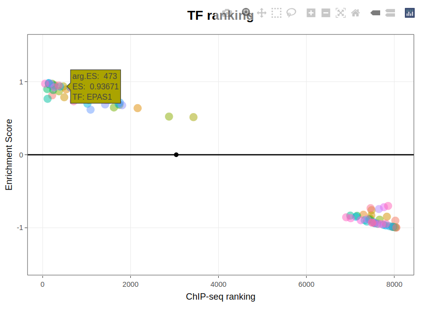
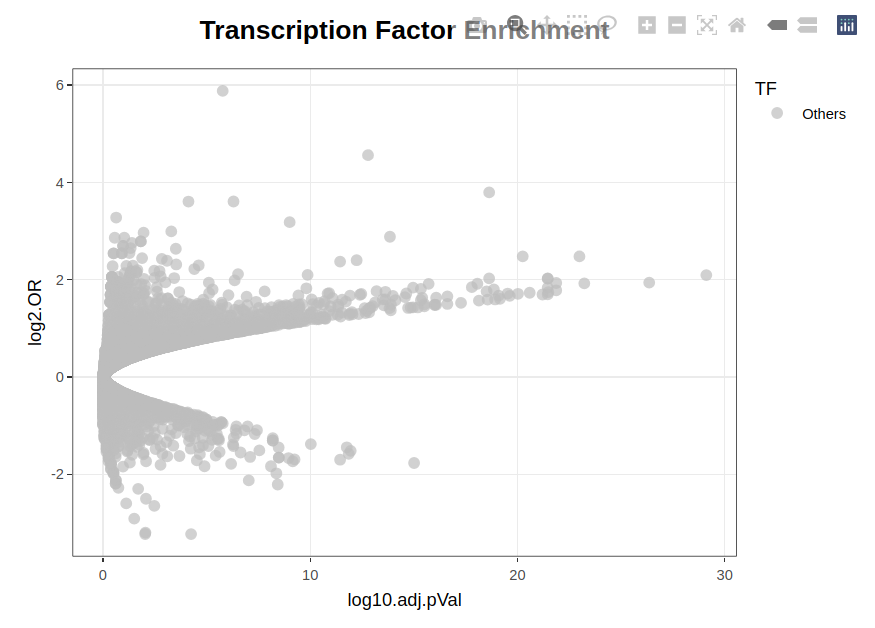
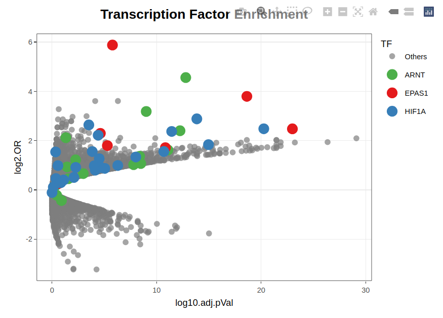
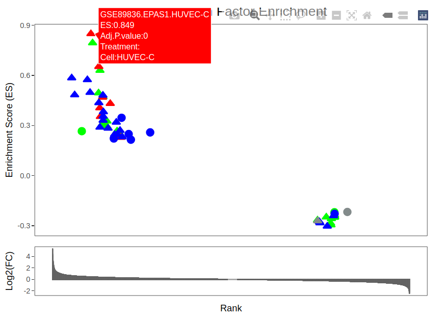
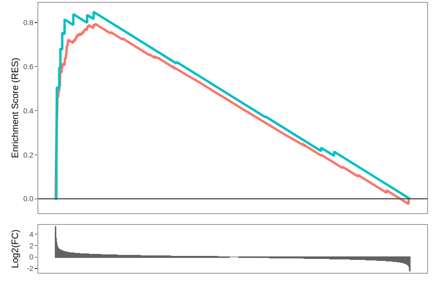

# Introduction
The identification of the transcription factor (TF) responsible for the corregulation of an specific set of genes is a common problem in transcriptomics. In the most simple scenario, the comparison of the transcriptome of cells or organisms in two conditions leads to the identification of a set of differentially expressed (DE) genes and the underlying assumption is that one or a few TFs regulate the expression of those genes. 
Traditionally, the identification of the relevant TFs has relied on the use of position weight matrices (PWMs) to predict transcription factor binding sites (TFBSs) proximal to the DE genes^[Wasserman, W.W., & Sandelin, A. (2004). Applied bioinformatics for the identification of regulatory elements. Nature Reviews Genetics, 5, 276–287. https://doi.org/10.1038/nrg1315]. The comparison of predicted TFBS in DE versus control genes reveals factors that are significantly enriched in the DE gene set. These approaches have been useful to narrow down potential binding sites, but can suffer from high rates of false positives. In addition, this strategy is limited by design to sequence-specific TF and thus unable to identify cofactors that bind indirectly to target genes. 

To overcome these limitations, TFEA.ChIP leverages the vast collection of publicly available ChIP-seq datasets to determine TFBSs linked to a given set of genes and performs enrichment analysis based on this experimentally derived, high-quality information. Specifically, TFEA.ChIP utilizes data from the ReMap 2022 repository, which contains hundreds of manually curated and uniformly processed DNA-binding experiments ^[Hammal, F., de Langen, P., Bergon, A., Lopez, F., & Ballester, B. (2022). ReMap 2022: a database of Human, Mouse, Drosophila and Arabidopsis regulatory regions from an integrative analysis of DNA-binding sequencing experiments. Nucleic Acids Research, 50(D1), D316–D325. https://doi.org/10.1093/nar/gkab996]. 

A critical step in this analysis is linking TF binding sites from ChIP-seq experiments to their target genes. The previous version of TFEA.ChIP ^[Puente-Santamaría, L., Wasserman, W.W., & del Peso, L. (2019). TFEA.ChIP: a tool kit for transcription factor binding site enrichment analysis capitalizing on ChIP-seq datasets. Bioinformatics, 35(24), 5339–5340. https://doi.org/10.1093/bioinformatics/btz573] relied on GeneHancer ^[Fishilevich, S., Nudel, R., Rappaport, N., Hadar, R., Plaschkes, I., Iny Stein, T., Rosen, N., Kohn, A., Twik, M., Safran, M., Lancet, D., & Cohen, D. (2017). GeneHancer: genome-wide integration of enhancers and target genes in GeneCards. Database (Oxford), 2017, bax028. https://doi.org/10.1093/database/bax028], an integrative resource that connects genes to regulatory elements by aggregating data from ENCODE, FANTOM5, eQTLs, and chromatin interaction datasets.
The current version of TFEA.ChIP includes a TF-gene interaction database constructed by integrating binding sites from the ReMap 2022 repository with enhancer-gene pairs generated by ENCODE-rE2G ^[Gschwind, A.R., et al. (2023). An encyclopedia of enhancer-gene regulatory interactions in the human genome. bioRxiv. https://doi.org/10.1101/2023.01.01.123456]. This database, which contains 8,103 datasets from ChIP-seq experiments covering 1,193 human transcriptional regulators, demonstrated the best performance in internal benchmarking analyses and is therefore the default in this version of the tool. Users can also choose alternative TF–gene interaction databases, including those used in previous versions or custom-defined datasets. Additional databases are available through the accompanying Bioconductor data package ExperimentHub (to be released), and more information can be found at:
https://github.com/LauraPS1/TFEA.ChIP_downloads and https://github.com/yberda/ChIPDBData.


TFEA.ChIP implements two enrichment analysis methods:

- **Overrepresentation Analysis.** It is the analysis of the association of TFBS and differential expression from 2x2 tables recording the presence of binding sites for a given TF in DE and control genes. The statistical significance of the association for each factor determined by a Fisher's exact test.
- **GSEA Analysis,** based on the core function of the GSEA algorithm developed by the GSEA team at the Broad Institute of MIT and Harvard^[Subramanian, A., Tamayo, P., Mootha, V.K., Mukherjee, S., Ebert, B.L., Gillette, M.A., Paulovich, A., Pomeroy, S.L., Golub, T.R., Lander, E.S., & Mesirov, J.P. (2005). Gene set enrichment analysis: a knowledge-based approach for interpreting genome-wide expression profiles. Proceedings of the National Academy of Sciences, 102(43), 15545–15550. https://doi.org/10.1073/pnas.0506580102] ^[Mootha, V.K., Lindgren, C.M., Eriksson, K.F., Subramanian, A., Sihag, S., Lehar, J., Puigserver, P., Carlsson, E., Ridderstråle, M., Laurila, E., Houstis, N., Daly, M.J., Patterson, N., Mesirov, J.P., Golub, T.R., Tamayo, P., Spiegelman, B., Lander, E.S., Hirschhorn, J.N., Altshuler, D., & Groop, L.C. (2003). PGC-1alpha-responsive genes involved in oxidative phosphorylation are coordinately downregulated in human diabetes. Nature Genetics, 34(3), 267–273. https://doi.org/10.1038/ng1180]

Although primarily designed for analyzing expression data from human cells, TFEA.ChIP includes an option to incorporate datasets from mouse experiments by translating mouse gene names to their human orthologs. Internal analyses indicate that this approach outperforms TF-gene databases derived from mouse-specific enhancer-gene associations.

# Analysis Example

TFEA.ChIP is designed to take the output of a differential expression analysis and identify TFBS enriched in the list of DE genes. In the case of the Overrepresentation Analysis, the only required input is a set of DE genes and, optionally, a set of control genes whose expression is not altered by the experimental conditions under study. For the GSEA analysis a ranked list of genes is required. This is supplied as a dataframe containing a column with gene names and a numerical column with the ranking metric, which typically are log2 fold change (LFC) or p-values for the gene expression changes in the two conditions under evaluation. 
To enhance integration with the Bioconductor ecosystem, the current version of the package natively supports output objects from widely used differential expression analysis tools such as edgeR and DESeq2.

For illustration purposes we will derive the input required for both analysis from a table containing the following field columns:

- Gene name (*Genes*). Internally the package uses Entrez IDs, but translating from Gene Symbols and ENSEMBL IDs is available.
- Log2 Fold Change (*Log2FoldChange*), indicating the difference in expression for each gene in the two experimental conditions being compared.
- p-value (*pvalue*) or adjusted p-value (*pval.adj*) for the difference in gene expression between the two conditions.

The output of popular packages, such as DESeq2, for detection of differentially expressed genes from the analysis of count data from RNA-seq experiments produce tables with this information, and the output table can be taken by the tool. The *hypoxia_DESeq* and *hypoxia* datasets are the output of a differential expression analysis performed on an RNAseq experiment analyzing the response to hypoxia of endothelial cells^[Tiana, M., Acosta-Iborra, B., Puente-Santamaría, L., Hernansanz-Agustín, P., Worsley-Hunt, R., Masson, N., García-Rio, F., Mole, D., Ratcliffe, P., Wasserman, W.W., Jiménez, B., & del Peso, L. (2018). The SIN3A histone deacetylase complex is required for a complete transcriptional response to hypoxia. Nucleic Acids Research, 46(1), 120–133. https://doi.org/10.1093/nar/gkx951] deposited at the NCBI's GEO repository (GSE89831).

We begin by loading the input data table into the R environment. The input is expected to be in a format compatible with results generated by the DESeq2 package:

```{r eval=TRUE,echo=TRUE,message=FALSE}
library(TFEA.ChIP)
library(dplyr)
library(meta)

data( "hypoxia_DESeq", "hypoxia", package="TFEA.ChIP" ) # Load example datasets
hypoxia_df <- preprocessInputData( hypoxia_DESeq )

# Display the first few rows
head(hypoxia_df)
```
  
Alternatively, the input can be a simple data frame containing columns for gene identifiers (such as Entrez IDs, Ensembl IDs, or gene symbols), LFC and p-values or adjusted p-values:
  
```{r eval=TRUE,echo=TRUE,message=FALSE}
# Preview the raw hypoxia dataset
head(hypoxia)
hypoxia <- preprocessInputData( hypoxia )

# Display the first few rows
head(hypoxia)

```

After processing the data with the `preprocessInputData()` function, the resulting dataset will be ready for downstream analysis with the TFEA.ChIP package. This function converts gene identifiers to Entrez Gene IDs and sorts the table by LFC for consistency.

> **_Note:_** Using the option `mode = m2h` will convert mouse gene IDs to their equivalent human gene ID, thus taking advantage of the wider availability of ChIP-seq experiments done on human cells. This strategy relies on the overlap between human and mouse transcription regulatory mechanisms. Nevertheless, we advise to be cautious using this approach, since extrapolating results from one organism to another is not always appropriate.


## Selecting a preferred TF–target gene database

By default, TFEA.ChIP uses a reduced internal reference database restricted to ChIP-seq experiments performed in ENCODE tier 1, 2, and 2.5 cell types. **This streamlined database is intentionally minimal to accommodate users with limited computing resources and may not fully capture the diversity of available TF–gene associations.** To perform enrichment analysis using the complete ChIP-seq database, load the curated dataset from `ExperimentHub` and assign it to an object named `ChIPDB` to override the default:

```{r eval=TRUE,echo=TRUE,message=FALSE}
library(ExperimentHub)
eh <- ExperimentHub()
ChIPDB <- eh[['EH9854']]  # rE2G300d
```

The database shown here is derived from ENCODE’s rE2G predictive models ("rE2G300d", see ChIPDBData GitHub repository for details). However, additional ready-to-use databases based on rE2G, GeneHancer, and CREdb are also available. To use one of these alternative databases, select a different entry in the `eh` object:

```{r eval=TRUE}
query(eh, "ChIPDBData")
```


## Overrepresentation analysis

### Identification of DE genes

As mentioned previously, this analysis requires two gene sets: one consisting of differentially expressed genes (e.g., upregulated), and another comprising control genes whose expression remains unchanged under the experimental conditions.

The `Select_genes()` function facilitates this selection. For example, upregulated genes can be defined as those with a LFC greater than 1 and an adjusted p-value (adjP) less than 0.05. Control genes can be selected based on an LFC between -0.25 and 0.25 and an adjP between 0.5 and 1:

```{r eval=TRUE,echo=TRUE}
# Extract vector with names of upregulated genes
Genes.Upreg <- Select_genes( hypoxia_df, min_LFC = 1, max_pval = 0.05 )

# Extract vector with names of non-responsive genes
Genes.Control <- Select_genes( hypoxia_df,
 min_pval = 0.5, max_pval = 1,
 min_LFC = -0.25, max_LFC = 0.25 )
```

### Translate the gene IDs to Entrez Gene IDs

In situations where preprocessing is not applicable, such as when using an external or manually curated gene list, gene identifiers must be standardized to Entrez Gene IDs for compatibility with the package's downstream functions. The `GeneID2entrez()` function supports this conversion:

```{r eval=TRUE,echo=TRUE,message=FALSE}
# Conversion of hgnc to ENTREZ IDs
GeneID2entrez( gene.IDs = c("EGLN3","NFYA","ALS2","MYC","ARNT" ) )

# To translate from mouse IDs:
# GeneID2entrez( gene.IDs = c( "Hmmr", "Tlx3", "Cpeb4" ), mode = "m2h" ) # To get the equivalent human gene IDs
```

###  Overrepresentation test

In this step, a contingency table is built for each TF represented in the ChIP-seq regulatory map. Each TF-specific contingency table summarizes the overlap between TF binding and differential expression:

|      |TFbound_yes|TFbound_no|
|------|:---------:|:--------:|
|DE_yes|number y/y |number y/n|
|DE_no |number n/y |number n/n|

Fisher’s exact test is then applied to each contingency table to evaluate the null hypothesis that TF binding and differential expression are independent events. In addition to raw p-values, the function returns false discovery rate (FDR)-adjusted p-values to account for multiple testing, as well as the odds ratio (OR), which quantifies the strength of the association between the DE genes and the TF based on ChIP-seq data.

```{r eval=TRUE,echo=TRUE}
CM_list_UP <- contingency_matrix( Genes.Upreg, Genes.Control ) # Generates list of contingency tables, one per dataset
pval_mat_UP <- getCMstats( CM_list_UP ) # Generates list of p-values and OR from association test
head( pval_mat_UP )
```

In the example above, all 8,103 TF binding datasets included in the internal database were used for the enrichment analysis. However, the analysis can be restricted to a specific subset of TFs. To do this, the `get_chip_index()` function can be used to generate an index referencing the desired subset of datasets. This index can then be passed as an argument to the `contingency_matrix()` function. 

```{r eval=TRUE,echo=TRUE}
chip_index <- get_chip_index( TFfilter = c( "HIF1A","EPAS1","ARNT" ) ) # Restrict the analysis to datasets assaying these factors

CM_list_UPe <- contingency_matrix( Genes.Upreg, chip_index = chip_index ) # Generates list of contingency tables
pval_mat_UPe <- getCMstats( CM_list_UPe, chip_index ) # Generates list of p-values and ORs
head( pval_mat_UPe )
```

> **_Note:_** When a complete ranked gene list is provided as input, the current version of the package can automatically identify expressed TFs and limit the analysis to that subset. Details on this process are explained later in the document. Additionally, specifying a control gene set is optional: if omitted, the function defaults to using all annotated human genes not included in the test set as controls.

The TFEA.ChIP package includes a metadata table that provides detailed information about each ChIP-seq dataset in the internal database. This includes experimental conditions, TF targets, and dataset sources. The metadata can be accessed as follows:

```{r eval=TRUE,echo=TRUE}
data("MetaData", package = "TFEA.ChIP")
head(MetaData)
```

The TFEA.ChIP package provides a function that integrates all key analysis steps into a single command, simplifying the workflow. This streamlined function is particularly helpful when working with complete gene tables, as **it can automatically detect TFs that are expressed in the input dataset and restrict the analysis accordingly.** By default, this filtering step is enabled to avoid testing TFs that are unlikely to be relevant in the given biological context, thereby reducing the multiple testing burden and increasing statistical power. If desired, this behavior can be disabled by setting the `expressed` argument to `FALSE`:

```{r eval=TRUE,echo=TRUE}
pval_mat_UPe <- analysis_from_table(hypoxia_df, 
 method = 'ora', # Overrepresentation Analysis
 interest_min_LFC = 1, # min LFC
 expressed = TRUE, # only take expressed TFs
 control_min_pval = 0.5, control_max_pval = 1, # control pval limits
 control_min_LFC = -0.25, control_max_LFC = 0.25) # control LFC limits

head( pval_mat_UPe )
```

In the analyses described above, each ChIP-seq dataset is treated independently. This approach allows for the identification of specific cell types or experimental conditions where a TF may be active, facilitating biological interpretation in relation to the study samples. Alternatively, the package supports the integration of all ChIP-seq datasets associated with a given TF, irrespective of experimental context. This strategy helps to highlight TFs that show consistent enrichment across conditions. The `rankTFs()` function enables this summarization by applying either a Wilcoxon rank-sum test or a GSEA approach to assess whether the ChIP-seq profiles corresponding to the same TF are collectively enriched or depleted in the ranked results.

> **_Important consideration:_** For TFs whose activity is highly context-dependent, aggregating ChIP-seq data across diverse experimental conditions may obscure biologically meaningful enrichments. Additionally, many public ChIP-seq datasets are derived from baseline or control conditions in which the TF may not be active. While this metadata is informative for interpreting individual experiments, it can confound integrated analyses. Therefore, we recommend using non-integrated (individual) results for more accurate and context-specific interpretation whenever possible.

```{r eval=FALSE, echo=TRUE}
TF_ranking <- rankTFs( pval_mat_UP, rankMethod = "gsea", makePlot = TRUE )
head( TF_ranking[[ "TF_ranking" ]] )
TF_ranking[[ "TFranking_plot" ]]
```



Meta-analyses can also be used to summarize results across multiple ChIP experiments for the same TF, accounting for the standard error of the OR. This approach gives greater weight to more precise estimates. However, it may also dilute effects that are context-dependent:

```{r eval=TRUE, echo=TRUE}
TF_ranking2 <- metaanalysis_fx( pval_mat_UP )
head( TF_ranking2[['summary']] )

# Get HIF results
filter(TF_ranking2$summary,
  TF %in% c("ARNT", "HIF1A", "EPAS1"))
```

In this analysis, `k` denotes the number of ChIP experiments included. `OR` represents the weighted average Odds Ratio, `OR.SE` is its standard error, and `CI` refers to the corresponding confidence interval. The pooled effect size (OR values) estimated by the meta-analysis integrates all datasets for a given TF, which may dilute effects that are context-dependent. However, a forest plot can be generated to visualize the results of individual experiments alongside the integrated value:

```{r eval=TRUE, echo=TRUE, fig.width=10, fig.height=6}
# Result for HIF1A
forest(TF_ranking2[['results']]$HIF1A)
```


### Plot results

The table of results generated by `getCMstats` can be parsed to select candidate TF. The function `plot_CM` uses the package `plotly` to generate an interactive plot representing the p-value against the Odds Ratio that is very helpful to explore the results:

```{r eval=FALSE, echo=TRUE}
plot_CM( pval_mat_UP ) # plot p-values against ORs
```



As expected for the hypoxia dataset, visual inspection of the enrichment graph reveals a strong signal for several HIF-related ChIP-seq datasets. These can be highlighted to emphasize their relevance in the current analysis:


```{r eval=FALSE, echo=TRUE}
HIFs <- c( "EPAS1","HIF1A","ARNT" )
plot_CM( pval_mat_UP, specialTF = HIFs ) # Plot p-values against ORs highlighting indicated TFs
```



## Gene Set Enrichment Analysis
    
### Generate a sorted list of ENTREZ IDs

The Gene Set Enrichment Analysis (GSEA) implemented in TFEA.ChIP requires a ranked list of genes as input. By default, the `preprocessInputData()` function sorts genes in descending order based on their LFC values. However, users can choose to rank genes using alternative numerical metrics, such as the p-value, adjusted p-value, or a composite measure like the product of LFC and –log10(p-value), depending on the specific goals of the analysis.

If a custom gene ranking is used, it is essential to ensure that gene identifiers are in Entrez Gene ID format. If necessary, the `GeneID2entrez()` function can be used to convert gene symbols or alternative identifiers into the required format.

### Select the ChIP-Seq datasets to analyze

By default, the analysis will include all the ChIP-Seq experiments available in the database. However, this analysis might take several minutes to run. To restrict the analysis to a subset of the database we can generate an index variable and pass it to the function `GSEA_run()`. This will limit the analysis to the ChIP-Seq datasets of the user's choosing. This index variable can be generated using the function `get_chip_index()` and allows the user to select the whole database, the set of ChIP-Seq experiments produced by the ENCODE project ("encode") or a specific subset of TFs (as a vector containing the TF names).

```{r eval=TRUE,echo=TRUE}
chip_index <- get_chip_index( TFfilter = c( "HIF1A","EPAS1","ARNT" ) ) # Restrict the analysis to datasets assaying these factors
```

### Run the GSEA analysis

The function `GSEA_run()` will perform a GSEA-based analysis on the input gene list. This function is based on the R-GSEA R script bundle written by the GSEA team at the Broad Institute of MIT and Harvard. The output of the analysis depends on the variable `get.RES`: 

* When `FALSE`, the function returns a data frame storing maximum Enrichment Score and associated p-value determined for each dataset included in the analysis.

* When `TRUE`, the function returns a list of three elements. The first element (*Enrichment.table*) is the enrichment data frame previously mentioned. The second element (*RES*) is a list of vectors containing the *Running Enrichment Scores* values (see GSEA documentation, http://software.broadinstitute.org/gsea/doc/GSEAUserGuideTEXT.htm#_Interpreting_GSEA_Results) for each of the sorted genes tested against each one of the analyzed ChIP datasets. The third element (*indicators*) is a list of vectors indicating if the sorted genes were bound by the factor analyzed in each ChIP dataset. 

```{r eval=TRUE,echo=TRUE,results='hide'}
# run GSEA analysis
GSEA.result <- GSEA_run( hypoxia_df$Genes, hypoxia_df$log2FoldChange, chip_index, get.RES = TRUE) 
```

Finally, the package provides a function that integrates all the above steps into a single command. In the current version of the package, only TFs present in the input sorted list of genes (i.e., TFs expressed under the conditions under study) are considered for the analysis. This default behavior can be overridden by setting the parameter `expressed` to `FALSE`:

```{r eval=TRUE,echo=TRUE}
GSEA.result <- analysis_from_table(hypoxia_df,
                                   TFfilter = c('ARNT', 'HIF1A', 'EPAS1'),
                                   expressed = TRUE,  # Takes only expressed TFs
                                   method = 'gsea') # Gene Set Enrichment Analysis
```

```{r eval=TRUE,echo=TRUE}
head(GSEA.result[["result"]][["Enrichment.table"]])
```


### Plotting the results

TFEA.ChIP provides two functions, `plot_ES()` and `plot_RES()`, to create interactive HTML visualizations of GSEA results.

  i) Plot Enrichment Scores with `plot_ES()`
  
The `plot_ES()` function generates an interactive enrichment score (ES) plot. It supports highlighting ChIP-seq datasets associated with specific TFs by displaying them in distinct colors, allowing users to easily identify TFs of interest within the broader analysis.

```{r eval=FALSE, echo=TRUE}
TF.hightlight <- c( "EPAS1","ARNT","HIF1A" )

plot_ES( GSEA.result$result, LFC = GSEA.result$processed_table$log2FoldChange, specialTF = TF.hightlight)
```


  ii) Plot Running Enrichment Scores with `plot_RES()` 
  
This function will plot **all** the RES stored in the `GSEA_run()` output. It is only recommended to restrict output to specific TF and/or datasets by setting the parameters `TF` and/or `Accession` respectively:
    
```{r eval=FALSE, echo=TRUE}
plot_RES( 
 GSEA_result = GSEA.result$result, LFC = hypoxia_df$log2FoldChange,
 Accession = c("GSE89836.ARNT.HUVEC-C", "GSE89836.EPAS1.HUVEC-C" ) )
```



# Building a TF-gene binding database

If the user wants to generate their own database of ChIPseq datasets, the functions `txt2gr()` and `makeChIPGeneDB()` automate most of the process. The required inputs are:

- A Metadata table (storing at least, Accession ID, name of the file, and TF tested in the ChIP-Seq experiment). The metadata table included with this package has the following fields: "Name", "Accession", "Cell", "Cell Type", "Treatment", "Antibody", and "TF".

- A folder containing ChIP-Seq peak data, either in ".narrowpeak" format or the MACS output files "_peaks.bed" -a format that stores "chr", "start", "end", "name", and "Q-value" of every peak-.


## Filter peaks from source and store them as a GRanges object

Specify the folder where the ChIP-Seq files are stored, create an array with the names of the ChIP-Seq files, and choose a format.
Set a `for` loop to convert all your files to GenomicRanges objects using `txt2GR()`. Please note that, by default, only peaks with an associated p-value of 0.05 (for narrow peaks files) or 1e-5 (for MACS files) will be kept. The user can modify the default values by setting the alpha argument to the desired threshold p-value.

```{r eval=FALSE,echo=TRUE}
folder <- "~/peak.files.folder"
File.list<-dir( folder )
format <- "macs"

gr.list <- lapply(
 seq_along( File.list ),
 function( File.list, myMetaData, format ){
 
 tmp<-read.table( File.list[i], ..., stringsAsFactors = FALSE )
 
 file.metadata <- myMetaData[ myMetaData$Name == File.list[i], ]
 
 ChIP.dataset.gr<-txt2GR(tmp, format, file.metadata)
 
 return(ChIP.dataset.gr)
 },
 File.list = File.list,
 myMetadata = myMetadata,
 format = format
)
```
```{r eval=TRUE,echo=TRUE}
# As an example of the output
data( "ARNT.peaks.bed","ARNT.metadata", package = "TFEA.ChIP" ) # Loading example datasets for this function
ARNT.gr <- txt2GR( ARNT.peaks.bed, "macs1.4", ARNT.metadata )
head( ARNT.gr, n=2 )
```


## Assign TFBS peaks from ChIP dataset to specific genes

The function `makeChIPGeneDB()` assigns the TFBS peaks in the ChIP datasets stored in `gr.list()` to a gene. To this end, a ChIP peak overlaping a regulatory region region receive the gene label associated to said region. By default the function also assigns the gene name when the ChIP peak does not overlap a regulatory region but maps at less than 10 nucleotides from it. This behaviour can be modified by setting the argument `distanceMargin` to the desired value (by default distanceMargin = 10 bases).

The resulting ChIP-Gene data base is a list containing two elements:
  - Gene Keys: vector of gene IDs.
  - ChIP Targets: list of vectors, one per element in gr.list, containing the putative targets assigned. Each target is coded as its position in the vector 'Gene Keys'.
```{r eval=TRUE,echo=TRUE}
data( "DnaseHS_db", "gr.list", package="TFEA.ChIP" ) # Loading example datasets for this function
TF.gene.binding.db <- makeChIPGeneDB( DnaseHS_db, gr.list ) 
str( TF.gene.binding.db )
```

The function, accepts any Genomic Range object that includes a metacolumn with a gene ID (stored in the @elementMetadata@listdata[["gene_id"]] slot of the object) for each genomic segment. For example, asignation of peaks to genes can be done by providing a list of all the genes in the genome:

```{r eval=TRUE,echo=TRUE}
library(TxDb.Hsapiens.UCSC.hg19.knownGene)
data( "gr.list", package="TFEA.ChIP") # Loading example datasets for this function
txdb <- TxDb.Hsapiens.UCSC.hg19.knownGene
Genes <- genes( txdb )
TF.gene.binding.db <- makeChIPGeneDB( Genes, gr.list, distanceMargin = 0 )
str( TF.gene.binding.db )
```

In this case the information about Dnase hypersensitivity is disregarded and peaks are assigned to overlapping genes (or genes closer than `distanceMargin` residues).

## Substitute the default database by a custom generated table.

At the beginning of a session, use the function `set_user_data()` to use your TFBS binary matrix and metadata table with the rest of the package.

```{r eval=FALSE,echo=TRUE}
set_user_data( binary_matrix = myTFBSmatrix, metadata = myMetaData )
```

```{r eval=TRUE,echo=TRUE}
sessionInfo()
```
